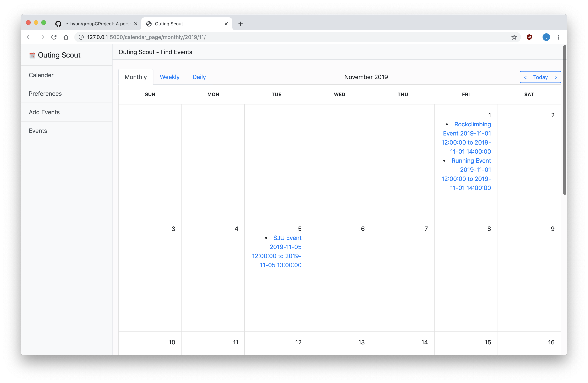
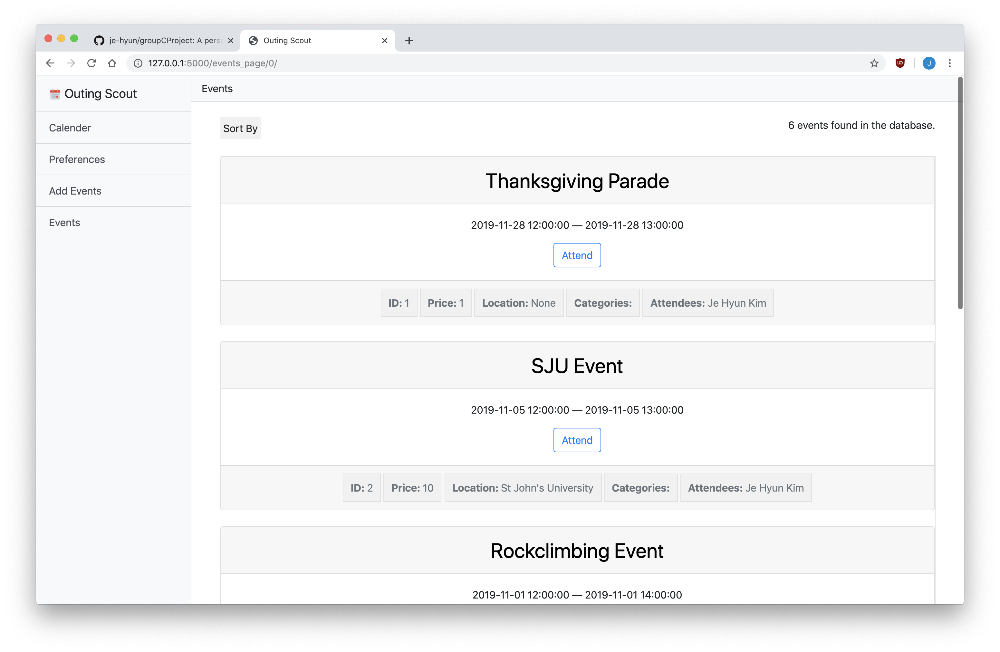

#### Outing Scout - A web app to find events.
A personalized event recommendation website which accommodates to your schedule and preferences.
<span>

 </span>
 <span>

 </span>

#### Basic folder structure.
- `app` : folder you implement your Flask project.
- `app.py`: In the main file that starts your sample project.
- `tests`: Here you need to include all unit and functional test for your project.
- `project_management` : In this folder you are expected to store all project documentation, and project deliverables associated with the course.

#### Run Instructions

```shell
git clone https://github.com/je-hyun/groupCProject.git
cd groupCProject
```

The project uses `pipenv` virtual environment. Make sure you install `pipenv` on your machine. Enter the virtual environment by typing:
```shell
pipenv shell
```

Once your virtual environment is activated, set up using these commands:
```shell
export FLASK_APP=app.py
pip install -r requirements.txt
```

And finally, to run:
```shell
flask run
```

Optionally, you could execute the following for developer mode:
```shell
export FLASK_ENV=development
```

#### Changing models.py
If you are adding to the project, you may find you want to change the database schema. If so, a database migration will be necessary. After you change the models.py file, you can run the following commands inside the project root directory to migrate the database.
```
flask db migrate -m "your description of changes"
flask db upgrade
```

If, for any reason during development, you need to downgrade to a previous version of the database, simply use this command.
```
flask db downgrade
```
